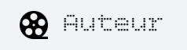

# Auteur - Your AI-Powered Filmmaking Studio

  

**Auteur is a web-based, AI-powered studio that empowers filmmakers, content creators, and storytellers to move from a spark of an idea to a fully-realized production plan with unprecedented speed and creativity.**

It's a digital workspace that combines flexible idea management with the powerful generative capabilities of Google's Gemini API, transforming fragmented notes and images into professional scripts, visual guides, and production documents.

---

### ✨ Core Features

Auteur is designed to be an intuitive and powerful partner throughout the pre-production process.

*   **🧠 AI-Powered Pre-Production Pipeline:** This is the core magic. Auteur synthesizes your scattered ideas, mood board images, project settings, cinematic style, and even your personal gear inventory. With a few clicks, it generates:
    *   A complete, professionally formatted **first-draft script**.
    *   A detailed **visual style guide** with notes on color, lighting, and mood.
    *   A practical **cinematography plan** with shot lists and gear recommendations tailored to *your* equipment.

*   **🎬 From Script to Shoot:** Auteur doesn't stop at the script. It automates the tedious parts of production planning:
    *   **AI Script Breakdown:** Automatically analyze your script to create a detailed scene-by-scene breakdown of characters, props, wardrobe, and more.
    *   **AI Call Sheet Generation:** Turn your script breakdown into a professional one-day call sheet, complete with schedules and cast/crew call times.

*   **📋 Comprehensive Board System:** Your workspace is a flexible grid of specialized boards for every stage of development:
    *   **Creative Boards:** Ideaboard for text notes, Moodboard & Storyboard for visual planning.
    *   **Document Boards:** A full suite of templates including Story Treatments, Character Profiles, Budgets, Shot Lists, Equipment Checklists, and Crew Contact Lists.

*   **🤖 AI-Powered Storyboarding:** Bring your vision to life instantly. On any Storyboard, type a description of a shot, and Auteur's integrated image generation AI will create it for you.

*   **✨ Dynamic Character & Crew Views:** Go beyond static lists. View your characters and crew in a stunning, interactive fullscreen grid of holographic profile cards, making your project feel alive.

*   **📷 Smart Gear Management:** Log your cameras, lenses, and other equipment in the Gear Manager. The AI uses this specific inventory to provide practical cinematography advice tailored to the tools you actually own.

*   **💬 Integrated Helpdesk:** Get unstuck without leaving the app. The built-in Help Desk provides a comprehensive FAQ and a specialized AI Chatbot trained to assist with any Auteur-related questions.

---

### 🚀 Getting Started: A Quick Guide

1.  **Create a Project:** Use the main menu to start a new project from a template (like 'Short Film') or a blank canvas.
2.  **Flesh out the Idea:**
    *   Use the **Ideaboard** to write down story concepts, dialogue, or random thoughts.
    *   Create a **Moodboard** and upload images that capture the project's tone.
    *   Develop your **Character Profiles** and **Story Treatment**.
3.  **Define Your Vision:** Open **Project Settings** to set technical specs (aspect ratio, etc.) and, most importantly, describe your desired **Cinematic Style**.
4.  **Log Your Gear:** Open **Manage Gear** from the main menu and add your equipment. The more specific you are, the better the AI's recommendations.
5.  **Generate & Refine:**
    *   Open the **Script** board and click `Generate with AI` in the footer. Auteur will write a first draft based on all your inputs.
    *   Refine the script in the editor. Once you're ready, click `Generate Breakdown` in the script's footer. A new **Script Breakdown** board will be created.
    *   Open the new breakdown board and click `Generate Call Sheet` to get a schedule for your first day of shooting!

---

### 🛠️ Tech Stack

Auteur is built with a modern, performant, and reliable technology stack:

*   **Frontend:** [React](https://reactjs.org/) & [TypeScript](https://www.typescriptlang.org/)
*   **AI Engine:** [Google Gemini API](https://ai.google.dev/)
*   **Styling:** [Tailwind CSS](https://tailwindcss.com/)
*   **Animations:** [GSAP (GreenSock Animation Platform)](https://greensock.com/gsap/)

---

### 🔌 Plugin Architecture

Auteur is built on a flexible plugin architecture, allowing developers to easily create and add their own custom board types. All of the core boards (like Ideaboard and Moodboard) are built using this same system.

A plugin is a simple object that registers itself with the application and provides the necessary components for rendering. Here's the basic structure of a plugin definition:

```typescript
// plugins/my-plugin/index.ts
import { registerPlugin } from '../../pluginSystem/pluginRegistry';
import { MyPluginView } from './MyPluginView';
import { MyIcon } from '../../components/icons';

const myPlugin = {
    type: 'PLUGIN_MY_COOL_BOARD', // A unique identifier
    title: 'My Cool Board',         // Name in the UI
    description: 'A short description.',
    icon: MyIcon,                  // React component for the icon
    boardComponent: MyPluginView,    // React component for the board view
};

export function initializeMyPlugin() {
    registerPlugin(myPlugin);
}
```

To add your plugin to the app, simply import and call your initializer function in `plugins/index.ts`.

---

### ❤️ Contributing

We believe in the power of collaboration and welcome contributions from the community! Whether you're fixing a bug, proposing a new feature, or improving documentation, your help is valued.

**How to Contribute:**

1.  **Fork the repository** on GitHub.
2.  **Clone your fork:** `git clone https://github.com/YOUR-USERNAME/auteur.git`
3.  **Set up your environment:**
    *   In the root of the project, create a new file named `.env`.
    *   Inside the `.env` file, add the following line, replacing the placeholder with your actual API key:
        ```
        API_KEY="YOUR_GOOGLE_GEMINI_API_KEY"
        ```
    *   *Note: This is a standard method for local development and ensures your private key is not checked into version control. The `.env` file is included in `.gitignore` and should never be committed to the repository.*
4.  **Create a new branch** for your feature or bug fix: `git checkout -b feature/my-awesome-feature`
5.  **Make your changes** and commit them with clear, descriptive messages.
6.  **Push to your branch:** `git push origin feature/my-awesome-feature`
7.  **Open a Pull Request** against the `main` branch of the original repository.

Please read our `CONTRIBUTING.md` for more detailed guidelines and our code of conduct.

---

### ⭐ Sponsor This Project

Auteur is a passion project dedicated to enhancing the creative process for filmmakers everywhere. If you find it useful or believe in its vision, please consider sponsoring its development.

Your sponsorship helps us cover API costs, dedicate more time to development, and build a sustainable future for the project.

**[➡️ Become a Sponsor on GitHub](https://github.com/sponsors/priyankt3i)**

---

### 📄 License

This project is licensed under the MIT License. See the [LICENSE](LICENSE) file for details.
